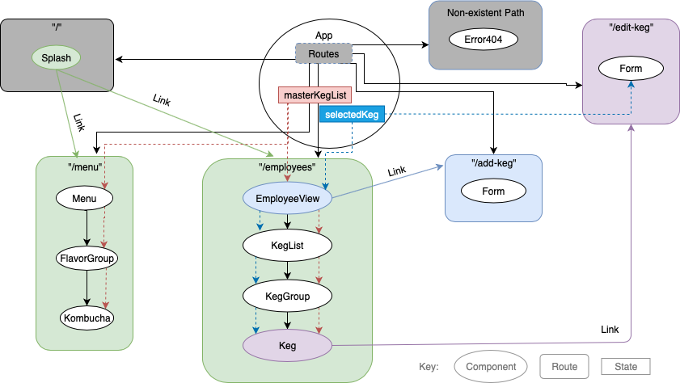

# Cultured People - A Kombucha Tap Room

#### _A Web app for viewing the menu and tracking kegs at a tap room - September 13, 2019_

#### _By **Na Hyung Choi**_

## Description
This Web app has a splash page that directs the user to either a menu for customers or an employee site for managing available kegs. 

The menu for customers shows available kombuchas on tap, categorized by flavor (herbal or fruity), and their information. If a keg gets tapped out, a "Sold Out" label appears next to the name.

The employee page shows a similar list of available kombucha kegs, with additional information about the amount of kombucha left in each keg. Each keg has 3 buttons associated with it: Pour, Edit, and Delete. Each time the Pour button is clicked, the keg's contents decrease by 1 pint. Kegs with 10 or less pints left are moved to the top of the list under "Running Low." When the keg reaches 0 pints, the "Pour" button stops working, and the customer-side menu will flag the item as Sold Out. Editing or deleting a keg will affect both the employee-side and customer-side lists. 

## React Component and Route Structure


## Setup/Installation Requirements

1. Clone this repository:
    ```
    $ git clone https://github.com/schoinh/tap-room.git
    ```
2. Install dependencies:
    ```
    $ npm install
    ```
3. Start development server:
    ```
    $ npm start
    ```
4. Navigate to localhost:8080 in your browser (Chrome recommended).

## Known Bugs
* User input validation is inadequate. Keg price per pint and pints left must be entered in integers.

## Technologies Used
* JavaScript
* React
* webpack
* npm

## Support and contact details

_Please contact Na Hyung with questions and comments._

### License

*GNU GPLv3*

Copyright (c) 2019 **_Na Hyung Choi_**
